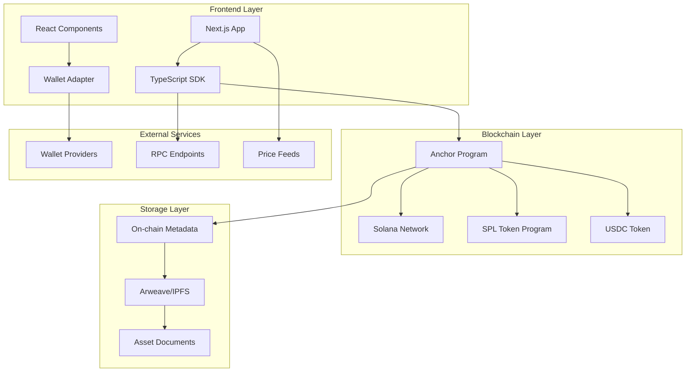
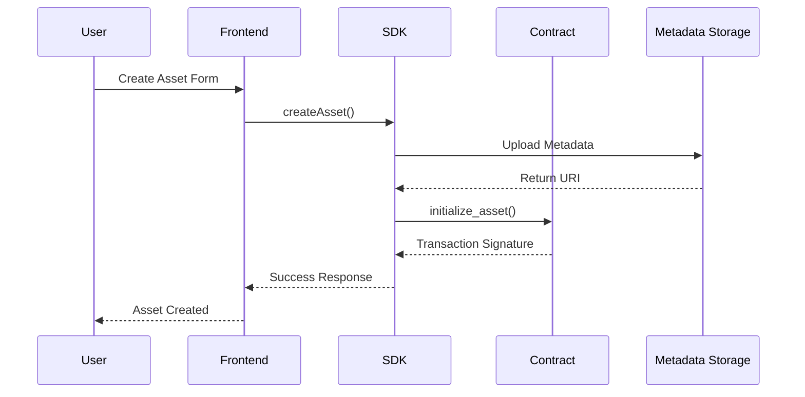
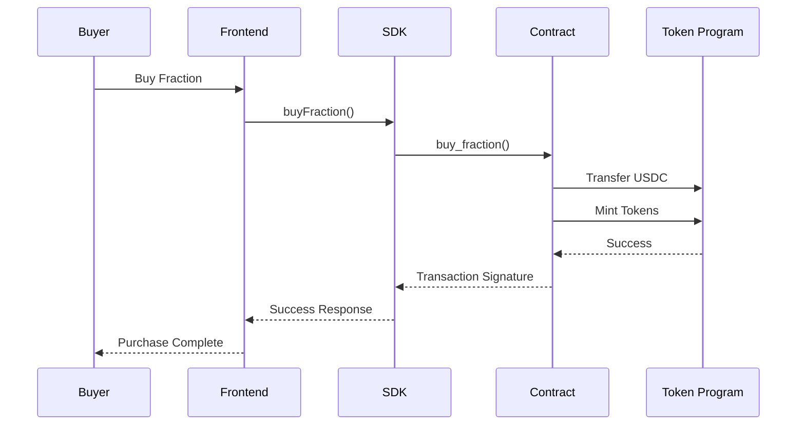
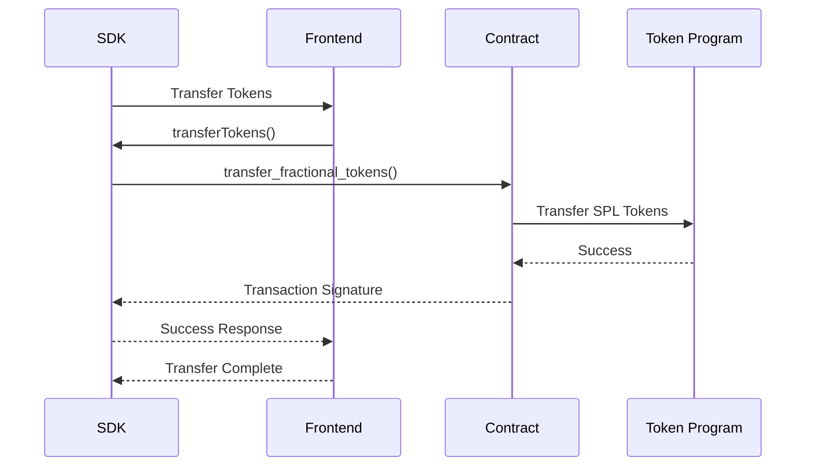

# Architecture Overview

This document provides a comprehensive overview of the Solana RWA Portal architecture, including system components, data flow, and technical decisions.

## System Architecture



## Core Components

### 1. Smart Contract (Anchor Program)

**Location**: `programs/rwa_token/src/lib.rs`

The smart contract is the core of the system, handling all on-chain logic for asset tokenization.

#### Key Functions:

- **`initialize_asset`**: Creates a new tokenized asset with metadata
- **`mint_fractional_tokens`**: Mints fractional ownership tokens
- **`transfer_fractional_tokens`**: Enables peer-to-peer token transfers
- **`buy_fraction`**: Handles USDC-based fractional purchases
- **`redeem`**: Burns tokens for asset ownership claims

#### Account Structure:

```rust
pub struct Asset {
    pub owner: Pubkey,           // Asset owner
    pub name: String,            // Asset name
    pub description: String,     // Asset description
    pub valuation: u64,          // Total valuation in USDC
    pub asset_type: AssetType,   // Asset category
    pub metadata_uri: String,    // Off-chain metadata pointer
    pub total_supply: u64,       // Maximum token supply
    pub minted_supply: u64,      // Currently minted tokens
    pub created_at: i64,         // Creation timestamp
    pub last_mint_at: i64,       // Last mint timestamp
    pub last_redeem_at: i64,     // Last redeem timestamp
    pub is_active: bool,         // Asset status
}
```

### 2. TypeScript SDK

**Location**: `sdk/src/`

The SDK provides a high-level interface for interacting with the smart contract.

#### Key Classes:

- **`RWAPortalClient`**: Main client for contract interactions
- **Utility Functions**: Helper functions for calculations and formatting
- **Type Definitions**: TypeScript interfaces for type safety

#### Features:

- Automatic transaction handling
- Error management and retry logic
- Balance calculations
- Metadata fetching and caching

### 3. Frontend Application

**Location**: `app/src/`

Built with Next.js 14 and React, providing a modern web interface.

#### Key Pages:

- **Landing Page** (`/`): Overview and wallet connection
- **Assets Page** (`/assets`): Browse and filter tokenized assets
- **Asset Detail** (`/asset/[id]`): Detailed asset information and trading
- **Dashboard** (`/dashboard`): User portfolio and transaction history

#### Key Components:

- **WalletProvider**: Manages wallet connection state
- **AssetCard**: Displays asset information in a card format
- **CreateAssetModal**: Form for creating new tokenized assets
- **BuyFractionModal**: Interface for purchasing fractional ownership

### 4. Metadata Storage

#### On-chain Metadata:
- Basic asset information (name, description, valuation)
- Asset type and status
- Token supply information
- Owner and creation timestamps

#### Off-chain Metadata:
- High-resolution images
- Detailed documentation
- Legal certificates
- Appraisal reports
- Stored on Arweave or IPFS for cost efficiency

## Data Flow

### 1. Asset Creation Flow



### 2. Fractional Purchase Flow



### 3. Token Transfer Flow



## Security Considerations

### 1. Smart Contract Security

- **Authority Checks**: Only asset owners can mint tokens
- **Supply Validation**: Prevents minting beyond total supply
- **Input Validation**: Validates all user inputs
- **Reentrancy Protection**: Uses Anchor's built-in protections

### 2. Frontend Security

- **Wallet Integration**: Secure wallet connection via official adapters
- **Input Sanitization**: All user inputs are validated
- **Error Handling**: Graceful error handling without exposing sensitive data
- **HTTPS**: All communications over secure connections

### 3. Data Security

- **Metadata Integrity**: Cryptographic hashes for metadata verification
- **Access Control**: Proper permission checks for all operations
- **Audit Trail**: All transactions are recorded on-chain

## Performance Optimizations

### 1. Smart Contract

- **Efficient Storage**: Minimal on-chain data storage
- **Batch Operations**: Support for batch transactions
- **Gas Optimization**: Optimized instruction sizes

### 2. Frontend

- **Code Splitting**: Lazy loading of components
- **Image Optimization**: Optimized asset images
- **Caching**: Client-side caching of metadata
- **Bundle Optimization**: Minimized JavaScript bundles

### 3. SDK

- **Connection Pooling**: Efficient RPC connection management
- **Retry Logic**: Automatic retry for failed transactions
- **Batch Requests**: Batch multiple RPC calls

## Scalability Considerations

### 1. Horizontal Scaling

- **Stateless Design**: Frontend and SDK are stateless
- **Load Balancing**: Multiple RPC endpoints
- **CDN**: Static assets served via CDN

### 2. Vertical Scaling

- **Database Optimization**: Efficient query patterns
- **Caching Layers**: Multiple levels of caching
- **Resource Monitoring**: Performance monitoring and alerting

### 3. Blockchain Scaling

- **Solana's High Throughput**: Leverages Solana's 65,000 TPS
- **Parallel Processing**: Concurrent transaction processing
- **Fee Optimization**: Low transaction costs

## Monitoring and Observability

### 1. Application Monitoring

- **Error Tracking**: Comprehensive error logging
- **Performance Metrics**: Response time monitoring
- **User Analytics**: User behavior tracking

### 2. Blockchain Monitoring

- **Transaction Monitoring**: Track all on-chain transactions
- **Account Monitoring**: Monitor account state changes
- **Network Health**: Monitor Solana network status

### 3. Business Metrics

- **Asset Metrics**: Track asset creation and trading volume
- **User Metrics**: Monitor user engagement and retention
- **Financial Metrics**: Track total value locked (TVL)

## Future Enhancements

### 1. Smart Contract Upgrades

- **Governance**: DAO-based governance for protocol changes
- **Advanced Trading**: Order book and AMM integration
- **Insurance**: Built-in insurance mechanisms
- **Compliance**: Enhanced regulatory compliance features

### 2. Frontend Improvements

- **Mobile App**: Native mobile applications
- **Advanced Analytics**: Detailed portfolio analytics
- **Social Features**: Community features and social trading
- **Gamification**: Reward systems and achievements

### 3. Integration Enhancements

- **Cross-chain**: Support for other blockchains
- **DeFi Integration**: Integration with DeFi protocols
- **Traditional Finance**: Bridge to traditional financial systems
- **API Access**: Public API for third-party integrations

## Technical Decisions

### 1. Why Solana?

- **High Performance**: 65,000 TPS with sub-second finality
- **Low Costs**: Fraction of a cent per transaction
- **Developer Experience**: Excellent tooling and documentation
- **Ecosystem**: Growing DeFi and NFT ecosystem

### 2. Why Anchor?

- **Type Safety**: Rust's type system prevents common bugs
- **Code Generation**: Automatic IDL generation
- **Testing**: Built-in testing framework
- **Security**: Battle-tested security patterns

### 3. Why Next.js?

- **Performance**: Excellent performance out of the box
- **Developer Experience**: Great developer tools and hot reloading
- **SEO**: Server-side rendering for better SEO
- **Ecosystem**: Large ecosystem of plugins and integrations

### 4. Why TypeScript?

- **Type Safety**: Compile-time error checking
- **Developer Experience**: Better IDE support and autocomplete
- **Maintainability**: Easier to maintain large codebases
- **Team Collaboration**: Better collaboration in team environments

This architecture provides a solid foundation for a scalable, secure, and user-friendly RWA tokenization platform on Solana.
